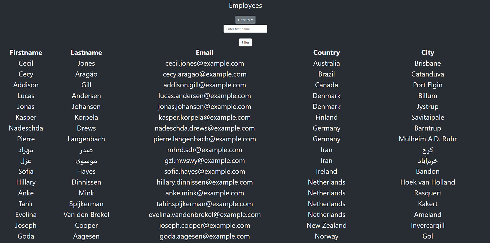

# Employee Directory <!-- omit in toc -->
--- 
### Table of Contents

- [Description](#description)
  - [Technologies Used](#technologies-used)
- [Installation](#installation)
- [How to use it](#how-to-use-it)
- [Future Development](#future-development)
- [Credits](#credits)
- [How to contribute](#how-to-contribute)
- [Tests](#tests)
- [License](#license)

## Live Site
[View Now](https://charlestbell.github.io/Employee-Directory/)

## Description
Manipulating Table Data

___Technologies Used___
- React
- Bootstrap
- Axios

___Motivation___
Practice manipulating table data

## Installation
Project deployed. No install necessary

## How to use it
Clicking the headers of each column will sort that column. To find a specific entry, choose a column to filter by from the dropdown, then type it in the field and click 'Filter'.

## Future Development
A database. A clear filter and sort button.

### Credits
Developers: C.T. Bell
### How to contribute
Email Me.

### Tests
No tests provided.

### License
#####MIT
[Link to MIT licence](https://opensource.org/licenses/MIT)

### Questions
If you have a question about this software, contact the developer at:
charlestbell@gmail.com

